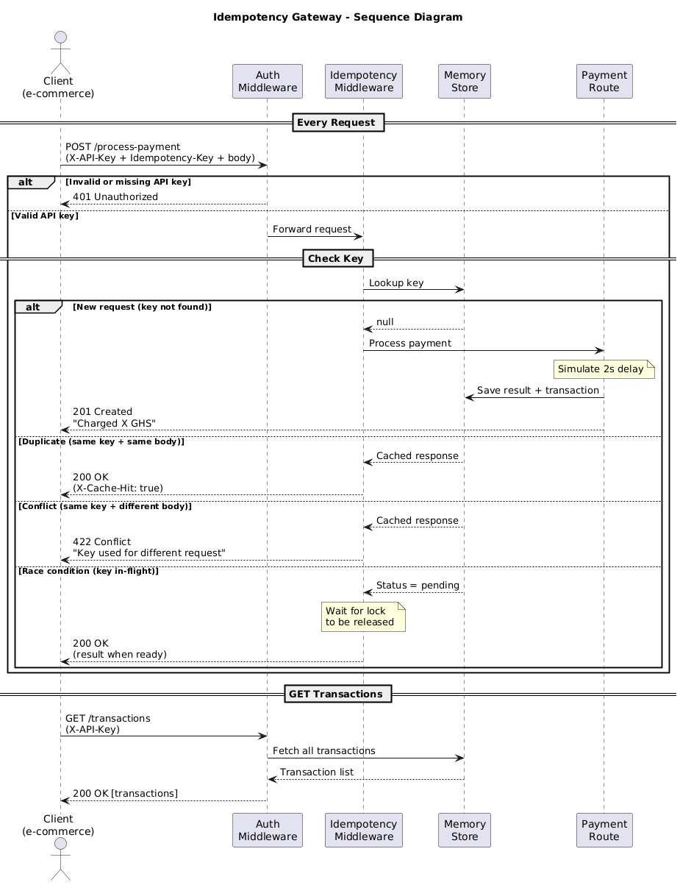

# Idempotency Gateway 
A RESTful API that ensures payment requests are processed exactly once, 
no matter how many times a client sends the same request.

Built with Node.js and Express.

---

## Table of Contents

1. [Architecture Diagram](#architecture-diagram)
2. [Setup Instructions](#setup-instructions)
3. [API Documentation](#api-documentation)
4. [Design Decisions](#design-decisions)
5. [Developer's Choice](#developers-choice)

---

## Architecture Diagram

The following sequence diagram shows the full flow of the system:



### Flow Summary

- Every request is first checked for a valid **API Key**
- Then checked for an existing **Idempotency Key**
- If the key is new → payment is processed and saved
- If the key exists and body matches → cached response is returned
- If the key exists but body is different → 422 error is returned
- If the key is in-flight → request waits for the first to complete

---

## Setup Instructions

### Prerequisites
- Node.js (v18 or higher)
- npm (v9 or higher)

### Installation

1. Clone the repository:

```bash
git clone https://github.com/EdudziNyaho/Idempotency-Gateway.git
```

2. Navigate into the project folder:

```bash
cd Idempotency-Gateway
```

3. Install dependencies:

```bash
npm install
```

4. Start the server:

```bash
npm start
```

5. Server will be running at: http://localhost:3000

### Running Tests

To run all automated tests:

```bash
npm test
```

To run a specific user story test:

```bash
npx jest test/UserStory1.test.js
npx jest test/UserStory2.test.js
npx jest test/UserStory3.test.js
npx jest test/BonusRaceCondition.test.js
npx jest test/DevelopersChoice.test.js
```

### Valid API Keys For Testing
```
test-api-key-123
client-api-key-456
```
---

## API Documentation

### Base URL
http://localhost:3000

### Required Headers
**X-API-Key**
Your API key for authentication. Required for all requests.

**Idempotency-Key**
A unique string that identifies the payment request. Required for POST /process-payment.

**Content-Type**
Must be set to `application/json`. Required for POST /process-payment.
---

### Endpoint 1: Process Payment

**POST /process-payment**

Used to process a payment. If the same request is sent again with the same Idempotency-Key, the saved response is returned immediately without processing again.

**Example Request:**
POST 
http://localhost:3000/process-payment

X-API-Key: test-api-key-123
Idempotency-Key: pay-abc-123
Content-Type: application/json

{
"amount": 100,
"currency": "GHS"
}

**Possible Responses:**

✅ New payment — 201 Created:
```json
{
  "transactionId": "4c23ecb4-34e1-4d61-98ac-c5b13c249c87",
  "status": "success",
  "message": "Charged 100 GHS"
}
```

✅ Duplicate request — 201 Created + X-Cache-Hit header:
```json
{
  "transactionId": "4c23ecb4-34e1-4d61-98ac-c5b13c249c87",
  "status": "success",
  "message": "Charged 100 GHS"
}
```

❌ Same key different body — 422 Unprocessable Entity:
```json
{
  "error": "Idempotency key already used for a different request body."
}
```

❌ Missing API key — 401 Unauthorized:
```json
{
  "error": "Missing X-API-Key header"
}
```

❌ Invalid API key — 401 Unauthorized:
```json
{
  "error": "Invalid API key"
}
```

---

### Endpoint 2: Transaction History

**GET /transactions**

Returns all past payments made by the authenticated client. Each client can only see their own transactions.

**Example Request:**
GET 
http://localhost:3000/transactions

X-API-Key: test-api-key-123

**Response — 200 OK:**
```json
{
  "count": 1,
  "transactions": [
    {
      "transactionId": "4c23ecb4-34e1-4d61-98ac-c5b13c249c87",
      "amount": 100,
      "currency": "GHS",
      "apiKey": "test-api-key-123",
      "timestamp": "2026-04-21T21:45:22.410Z"
    }
  ]
}
```
---

## Design Decisions

### 1. Node.js and Express
Chosen because Express is lightweight and perfect for building REST APIs quickly. It has a simple middleware system which made implementing the idempotency layer straightforward.

### 2. In-Memory Store (JavaScript Map)
Chosen over a database because:
- No setup required
- Fast O(1) lookup time
- Sufficient for demonstrating idempotency logic

### 3. Middleware Architecture
The idempotency logic was built as middleware so it runs before the payment route. This keeps the payment route clean and makes the idempotency logic reusable across other routes.

### 4. UUID for Transaction IDs
Used the `uuid` library to generate unique transaction IDs. This guarantees no two transactions will ever have the same ID.

### 5. JSON Body Comparison
Used `JSON.stringify()` to compare request bodies. This converts the body to a string so it can be compared easily.

### 6. Race Condition Handling
Used a polling mechanism with `setInterval` to check every 100ms if an in-flight request has completed. This prevents duplicate processing without using complex locking mechanisms.

---

## Developer's Choice

### Feature 1: API Key Authentication
**What it does:** Every request must include a valid `X-API-Key` header. Requests without a valid key are rejected with a `401 Unauthorized` response.

**Why it was added:** Most payment systems have a means of identifying who is sending the request. This feature implements that by maintaining a set of valid API keys. It prevents users that have not been previously authorized from sending requests to the system.

### Feature 2: Transaction History
**What it does:** Clients can send a `GET` request to `/transactions` with their API key to view all their past payments.

**Why it was added:** In a real payment system, clients need to be able to see their past transactions. This feature allows them to verify that payments were processed correctly and troubleshoot any issues. Each client can only see their own transactions using their API key.

---

## Project Structure
```
Idempotency-Gateway/
├── index.js                       ← Server entry point
├── middleware/
│   ├── Auth.js                    ← API key authentication
│   └── Idempotency.js             ← Idempotency logic
├── routes/
│   ├── Payment.js                 ← POST /process-payment
│   └── Transactions.js            ← GET /transactions
├── store/
│   └── MemoryStore.js             ← In-memory data store
├── test/
│   ├── payment.test.js            ← Master test file
│   ├── UserStory1.test.js         ← First transaction tests
│   ├── UserStory2.test.js         ← Duplicate request tests
│   ├── UserStory3.test.js         ← Conflict check tests
│   ├── BonusRaceCondition.test.js ← Race condition tests
│   └── DevelopersChoice.test.js   ← Auth and transaction tests
├── SequenceDiagram.png            ← Architecture diagram
├── package.json
└── .gitignore
```